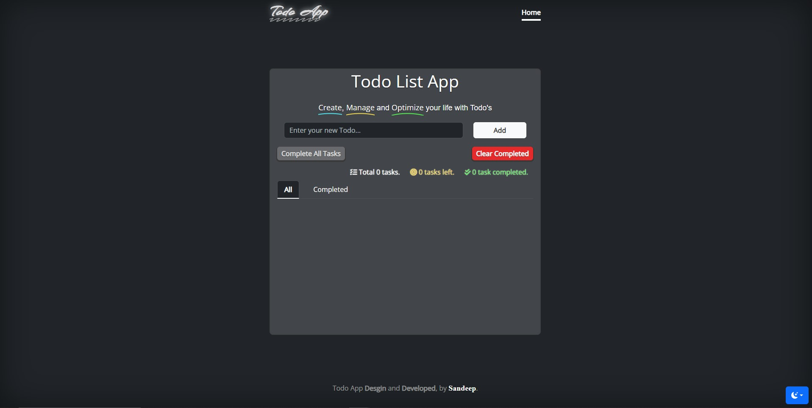
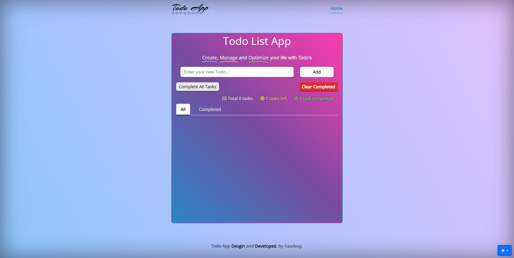
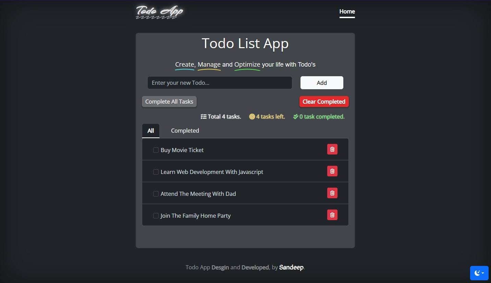
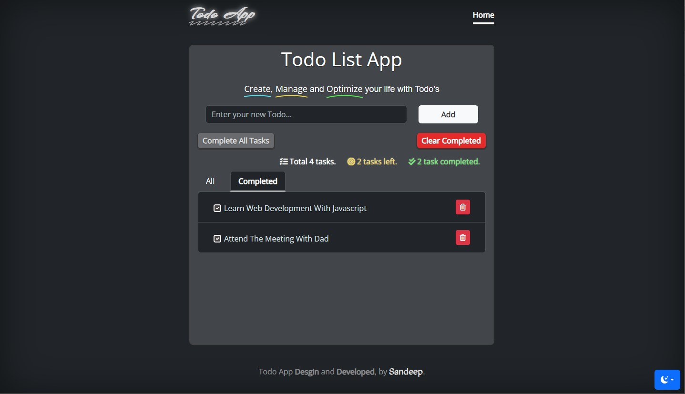
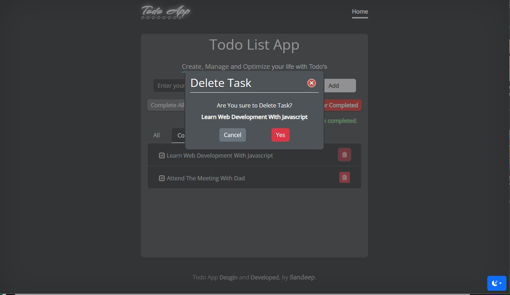
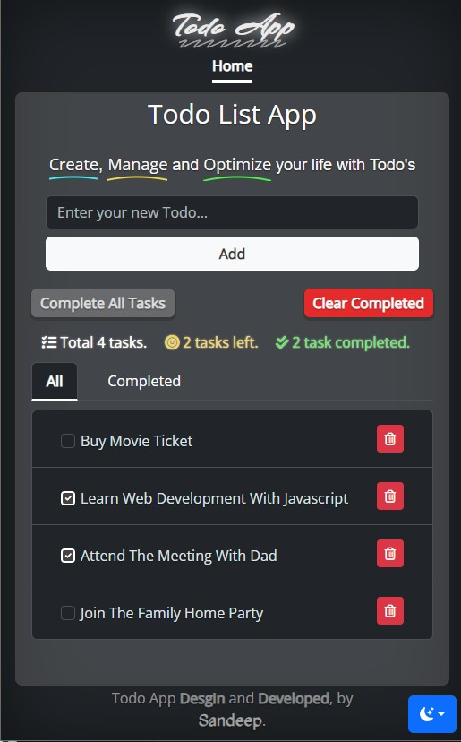
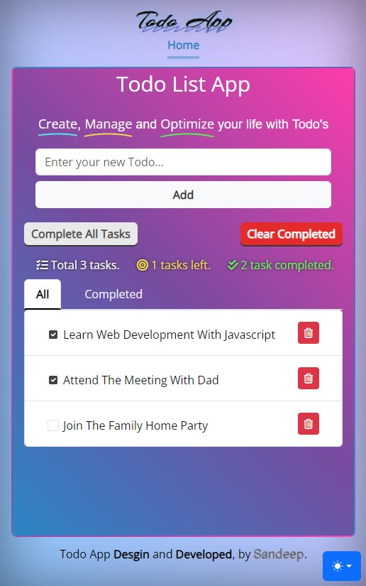
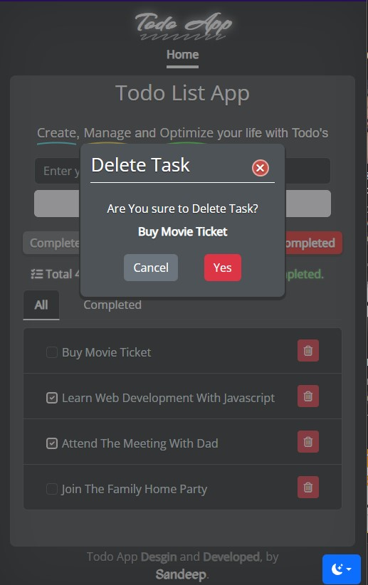
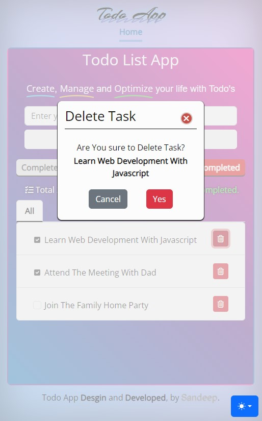

# Todo Ninja App

This Todo app is a lightweight web application developed using HTML, CSS, and vanilla JavaScript, with Bootstrap CSS for enhanced styling.

## Features

- Add new todos
- Mark todos as complete by checking the checkbox
- Delete individual todos
- Mark all todos as complete
- Delete completed todos
- View completed todos separately using the "Completed" tab
- View all todos using the "All" tab

## How to Use

1. **Add Todo:** Type your task in the input field and press Enter to add a new todo.

2. **Mark as Complete:** Check the checkbox next to a todo to mark it as complete.

3. **Delete Todo:** Click the delete icon to remove an individual todo.

4. **Mark All Complete:** Click the "Mark All Complete" button to mark all todos as complete.

5. **Delete Completed Todos:** Click the "Delete Completed" button to remove all completed todos.

6. **View Completed Todos:** Switch to the "Completed" tab to see only completed todos.

7. **View All Todos:** Switch to the "All" tab to see all todos, including completed ones.

## Snapshots

#### Desktop View

#### Mobile View

## Technologies Used

- HTML
- CSS
- JavaScript
- Bootstrap CSS

Feel free to use, modify, and enhance this simple Todo app according to your needs. Happy organizing!

Developed & designed by 
[Sandeep Kumar Kushwaha](https://github.com/SandeepKushwaha/)
